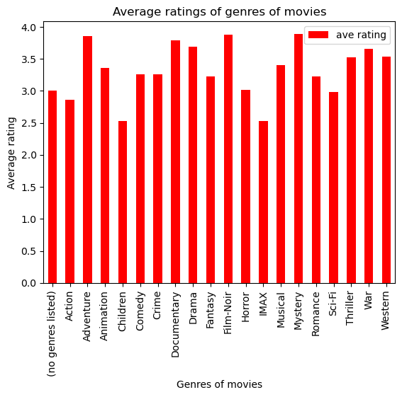
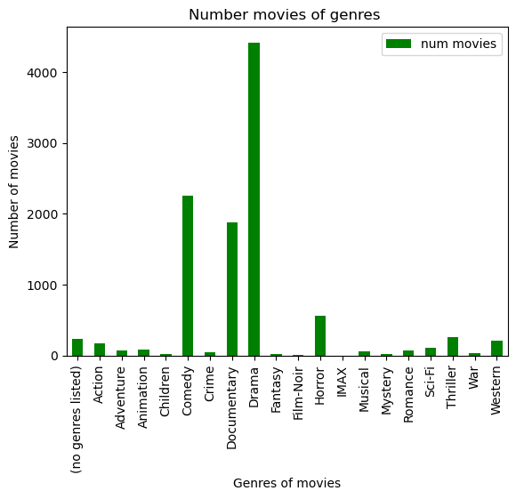
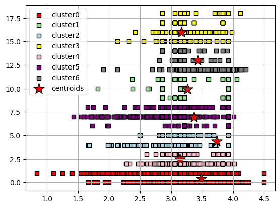
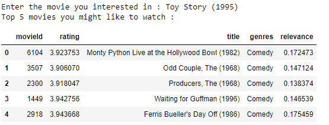

# Related movies recommendation
Related movies recommendation Machine Learning Project

## Datasets : 
This Datasets for analysis and training are collected from MovieLens 20M Dataset in Kaggle. 

- Link to dataset : [http://grouplens.org/datasets/movielens/20m/](https://www.kaggle.com/datasets/grouplens/movielens-20m-dataset)

## Frameworks : 
* [Python](https://www.python.org/)
* [Numpy](https://numpy.org/)
* [Pandas](https://pandas.pydata.org/)
* [Scikit-learn](https://scikit-learn.org/stable/)

## Steps in the project : 
1. Analyze the dataset to find out the trends of movie genres.
2. Build a movie recommendation system based on K-Means.

## Result of project:
### 1. Analysis of the dataset 
From the collected data, two DataFrames representing information about movies and movie genres were found with the help of Pandas Framework.

* DataFrame representing information of movies was saved to the file 'movie_rating.csv'
* DataFrame representing information of movie genres was saved to the file 'Genre_Rating.csv'

Movies | Genres of movie 
:----|----:
|  

From that, the trends of movie genres were found
Average rating of genres | Number of ratings of genres | Number movies of genres
:----|----|----:
 |    | 

### 2. Model K-Means for recommendation of movies
A model K-Means with 7 cluster was build to find related movies with given movie.

When we give a my favourite movie, system will give us a list of 5 most similar movies, what we might be interested in:

